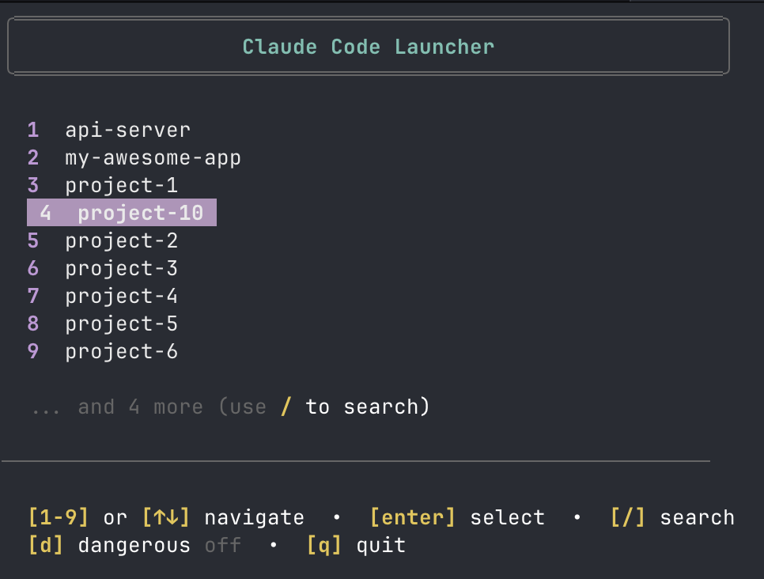

# Claude Code Launcher

Terminal-based project launcher for [Claude Code](https://claude.ai/code). Navigate your GitHub projects with arrow keys and search.

Cd-ing into your repository and starting claude from there is annoying. This is intended to solve that. Simply run `code` in your terminal and select your project.

Intended for mac, and for my very specific workflow.

## Screenshot



## Installation

1. Clone the repository:

   ```bash
   git clone https://github.com/idomanteu/claude-code-launcher.git
   cd claude-code-launcher
   chmod +x code launcher.js
   ```

2. Add alias to your shell profile:

   ```bash
   # For Bash
   echo 'alias code="$HOME/claude-code-launcher/code"' >> ~/.bashrc
   source ~/.bashrc

   # For Zsh
   echo 'alias code="$HOME/claude-code-launcher/code"' >> ~/.zshrc
   source ~/.zshrc
   ```

   Example: If you cloned to `/Users/name/claude-code-launcher/`, use:

   ```bash
   echo 'alias code="/Users/name/claude-code-launcher/code"' >> ~/.bashrc
   ```

3. Test the installation:
   ```bash
   code
   ```

## Usage

Run `code` to launch. Use arrow keys or numbers (1-9) to navigate, `/` to search, `d` for dangerous mode, `q` to quit.

## Requirements

- Node.js 14+
- [Claude Code CLI](https://claude.ai/code)
- Projects in `~/Documents/GitHub/`

## License

MIT
